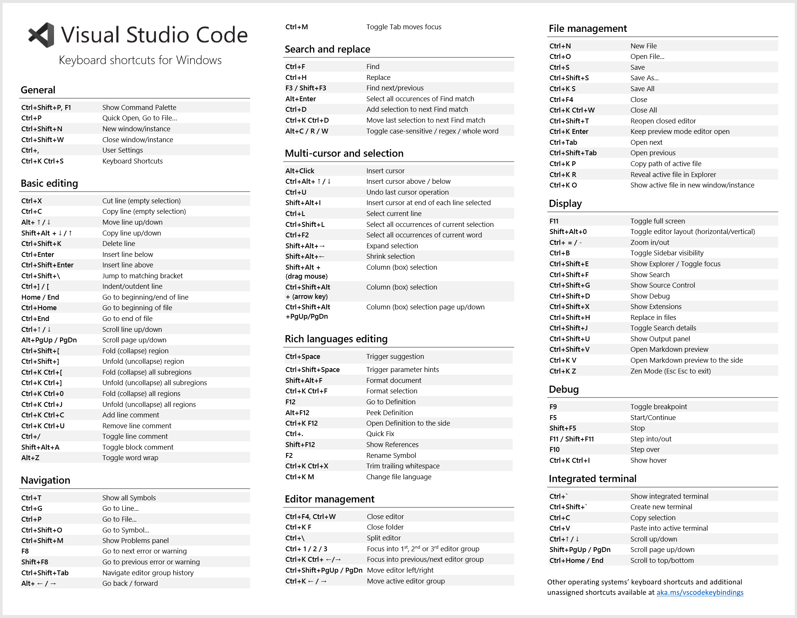
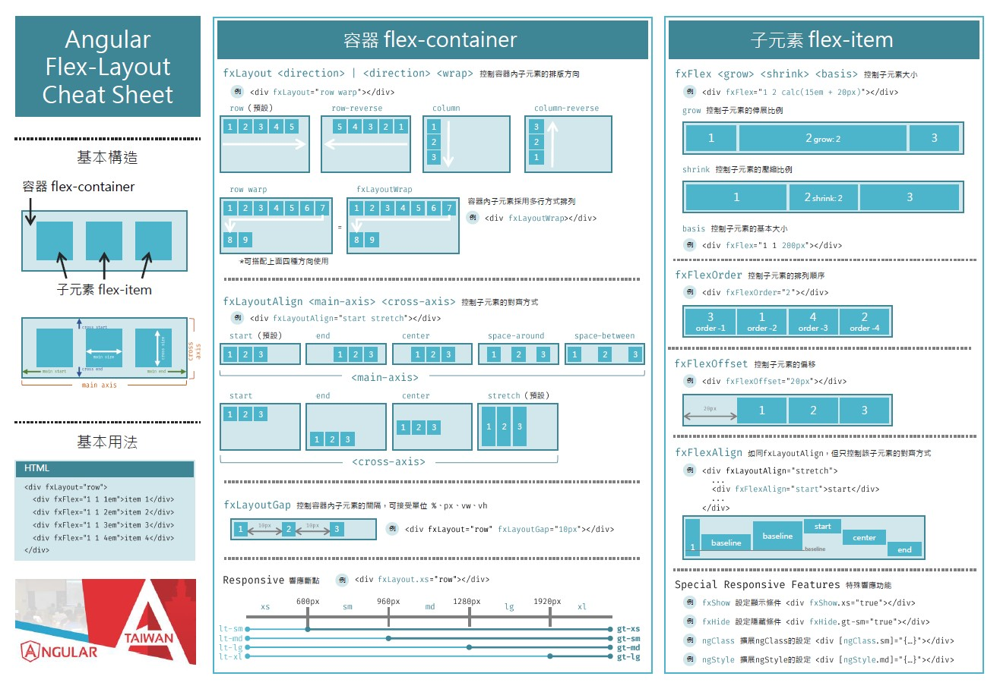
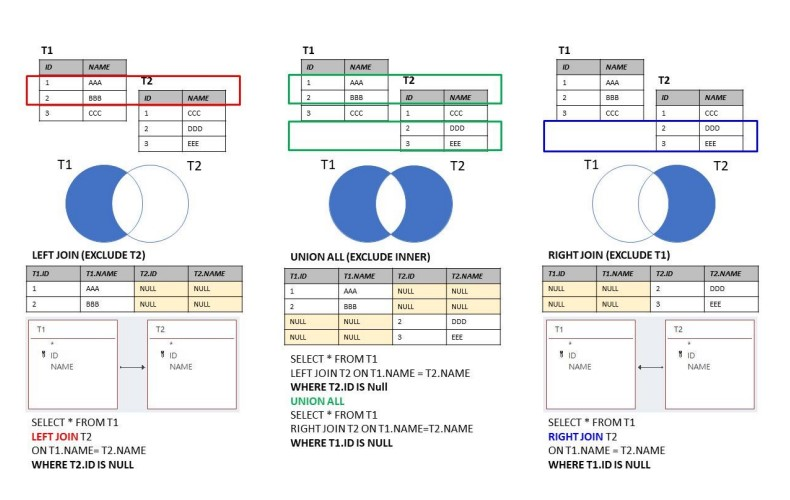
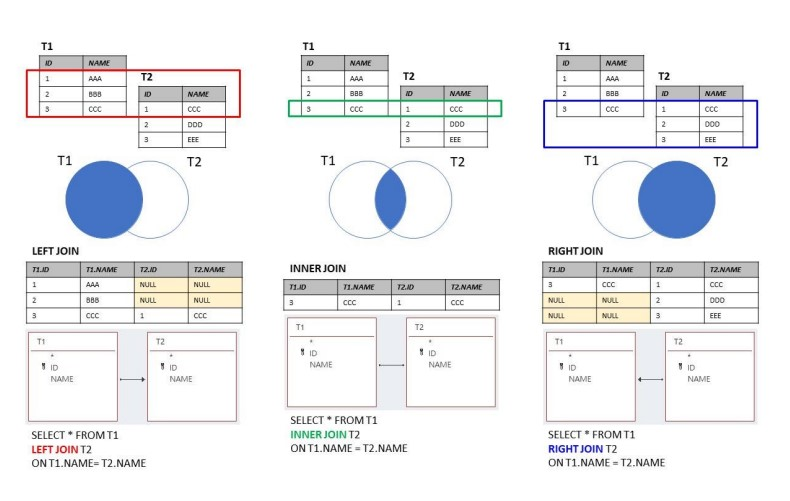
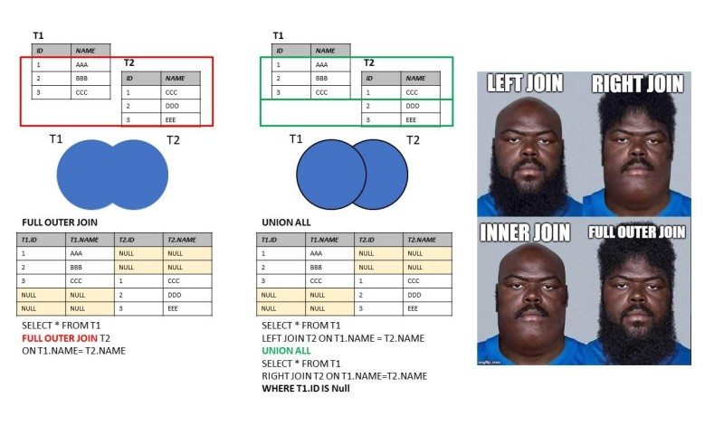
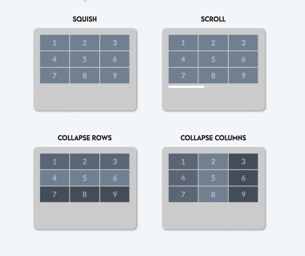

# Cheat Sheet

### VScode

### Ng-Flex-Layout

> Vscode
>
> * Shift+Alt + ↓ / ↑：複製行
> * Ctrl+Shift+\：跳到對應括弧\(頭 or 尾\)
> * Ctrl+/：註解行
> * Ctrl+\：分割檔案
> * Shift+Alt+A：註解整段
> * Shift+Alt+→/←：選取/取消單字
> * Shift+Alt+F：排版
> * Ctrl+\(Shift\)+Enter：下方\(上方\)插入空行
> * Ctrl+Alt+D：產生參數說明
> * Ctrl+Shift+e：file explorer
> * Ctrl+K+0：全部收起
> * Ctrl+Alt+↓ / ↑：加游標
> * Ctrl+Alt+→/←：移動editor
> * Ctrl+\：split editor
> * Ctrl+K M：Change file language

### SQL join

### RWD

### Angular Ref

### Angular Ref

